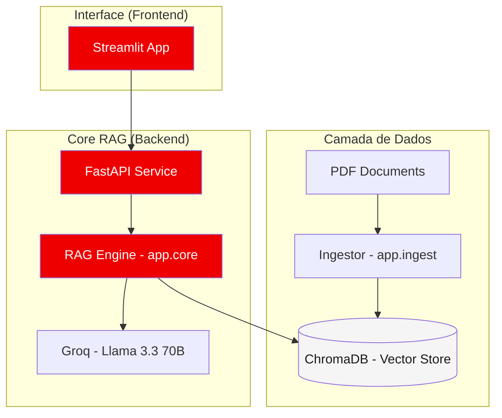

# Red Hat AI Consultant - RAG Architecture

Este repositório contém  solução completa **Retrieval-Augmented Generation (RAG)** para consultas inteligentes em documentos técnicos internos. 


##  Arquitetura do Sistema

A solução utiliza uma arquitetura desacoplada, permitindo escalabilidade independente entre o mecanismo de ingestão,  inferência (API) e a interface do usuário.



### Principais Decisões Técnicas
1.  **Orquestração de Contexto (LangChain):** Utilizado pela sua flexibilidade em gerenciar cadeias complexas de RAG e integração nativa com diversos provedores de embeddings.
2.  **LLM de Alta Performance (Llama 3.3):** A escolha pela API da Groq permite latência ultra-baixa em modelos de larga escala (70B), essencial para uma experiência de chat fluida.
3.  **Embeddings Locais:** Uso do `sentence-transformers/all-MiniLM-L6-v2` para garantir que o processamento vetorial inicial ocorra sem custos de API e com boa precisão semântica para o português/inglês técnico.
4.  **Vector Store (ChromaDB):** Banco de dados vetorial leve e eficiente, persistido localmente para este MVP, mas facilmente migrável para soluções em nuvem.
5.  **FastAPI + Streamlit:** Separação clara entre a lógica de negócio (API) e a interface (UI), seguindo as melhores práticas de microserviços.

---

## Como Executar o Projeto Localmente

### Pré-requisitos
- Python 3.12+
- Chave de API da [Groq](https://console.groq.com/)

### 1. Preparação do Ambiente
```powershell
# Clonar o repositório
cd redhat_rag

# Criar e ativar ambiente virtual
python -m venv .venv
.\.venv\Scripts\activate

# Instalar dependências
pip install -r requirements.txt
```

### 2. Configuração
Crie um arquivo `.env` na raiz da pasta `redhat_rag`:
```env
GROQ_API_KEY=sua_chave_aqui
CHROMA_DB_DIR=chroma_db
DATA_DIR=data
```

### 3. Ingestão de Documentos (Opcional se já existir chroma_db)
Coloque seus PDFs na pasta `data/` e rode:
```powershell
python -m app.ingest
```

### 4. Execução (Dois Terminais)
**Terminal 1 (Backend):**
```powershell
uvicorn app.api:app --reload --port 8000
```

**Terminal 2 (Frontend):**
```powershell
streamlit run app/frontend.py
```

### 5. Testando a API (Swagger UI)
Além do frontend em Streamlit, você pode testar a API diretamente (recebendo o retorno em JSON) através da interface do Swagger:
- Acesse: `http://localhost:8000/docs`
- Clique no endpoint `POST /query`.
- Clique em **Try it out**, insira sua pergunta no JSON e clique em **Execute**.

---

## Escalonamento para Produção
Para levar esta solução ao nível enterprise, as seguintes mudanças são recomendadas:

1.  **Vector Database Gerenciado:** Migrar do ChromaDB local para **Qdrant**, **Pinecone** ou **FAISS**, permitindo busca vetorial em bilhões de registros com alta disponibilidade.
2.  **Mecanismo de Ingestão Assíncrono:** Utilizar **Redis + Celery** para processar centenas de documentos em background, enviando notificações ao usuário via WebSockets quando concluído.
3.  **Segurança e Governança:** Implementar **Red Hat OpenShift API Management** (3scale) para autenticação (OIDC), rate limiting e monetização da API.
4.  **Cache Semântico:** Implementar um cache baseada em similaridade (ex: GPTCache) para reduzir custos de LLM em perguntas repetitivas ou similares.

---

## Limitações e Melhorias Futuras
- **Context Window:** Atualmente o k-valor de recuperação é fixo. Melhoria: Implementar *Long-Context Re-ranking* (Cohere/Ranker) para melhorar a precisão após a recuperação inicial.
- **Multimodalidade:** O parser atual foca em texto. Melhoria: Adicionar suporte a OCR e leitura de tabelas complexas nos PDFs.
- **Avaliação:** Adicionar um framework de avaliação de RAG (como **Ragas** ou **Trulens**) para medir fidelidade e relevância das respostas de forma quantitativa.

---
